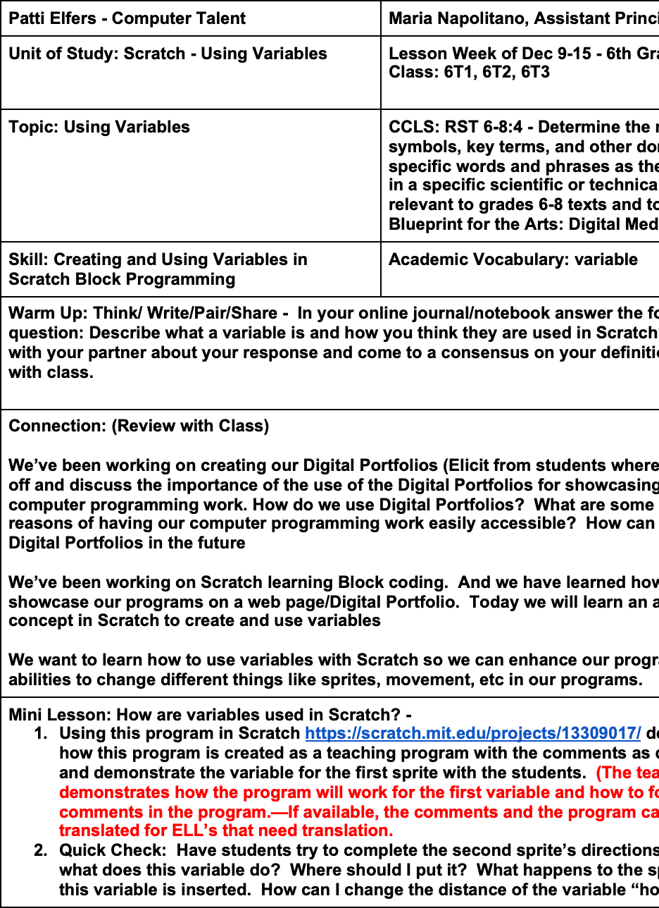

Patti Elfers - Computer Talent	Maria Napolitano, Assistant Principal
Unit of Study: Scratch - Using Variables	Lesson Week of Dec 9-15 - 6th Grade
Class: 6T1, 6T2, 6T3

Topic: Using Variables

	CCLS: RST 6-8:4 - Determine the meaning of symbols, key terms, and other domain specific words and phrases as they are used in a specific scientific or technical context relevant to grades 6-8 texts and topics.
Blueprint for the Arts: Digital Media
Skill: Creating and Using Variables in Scratch Block Programming	Academic Vocabulary: variable
Warm Up: Think/ Write/Pair/Share -  In your online journal/notebook answer the following question: Describe what a variable is and how you think they are used in Scratch? Then talk with your partner about your response and come to a consensus on your definition. Share with class.

Connection: (Review with Class)

We’ve been working on creating our Digital Portfolios (Elicit from students where we last left off and discuss the importance of the use of the Digital Portfolios for showcasing important computer programming work. How do we use Digital Portfolios?  What are some of the reasons of having our computer programming work easily accessible?  How can we use our Digital Portfolios in the future

We’ve been working on Scratch learning Block coding.  And we have learned how to showcase our programs on a web page/Digital Portfolio.  Today we will learn an additional concept in Scratch to create and use variables

We want to learn how to use variables with Scratch so we can enhance our programming abilities to change different things like sprites, movement, etc in our programs.
Mini Lesson: How are variables used in Scratch? - 
1.	Using this program in Scratch https://scratch.mit.edu/projects/13309017/ demonstrate how this program is created as a teaching program with the comments as directions and demonstrate the variable for the first sprite with the students.  (The teacher demonstrates how the program will work for the first variable and how to follow the comments in the program.—If available, the comments and the program can be translated for ELL’s that need translation.
2.	Quick Check:  Have students try to complete the second sprite’s directions.  Ask, what does this variable do?  Where should I put it?  What happens to the sprite when this variable is inserted.  How can I change the distance of the variable “howfartogo?”
3.	Show students all of the sprites and after working through the first sprite script together, have students try the second one on their own, (5 minutes if needed)
4.	ASSESS by checking each student’s monitor to see if they followed the directions given for the sprite and assist as needed to complete the task. (Observe student work by walking around the room checking their screens to see if they have been successful.)

Work period: Grouping: Students will work at their own pace with their neighbor (Several students have been purposefully seated for help with language translation and others are seated with those that have higher academic skills to help those with IEP’s or learning disabilities). Students are not aware of their differences at the beginning of the year about their ability levels, only the language differences groups are aware.

	Task 1.Assessment:  Teacher walks around the room watching students demonstrate their coding for the second sprite.  Share the completed script for the code
Task 2:  If you are able to complete the second sprite, then move on to the third and fourth.
Task 3: For the fifth sprite, they are asking your to complete the program with your own variable.  Hint:  Look back at the other scripts from the four sprites.  How can you use what is there to complete the 5th sprite variable?
Here the students are able to work with their partner and benefit from talking though what they want to code and how to debug with their peer if needed.
Assessments/Questions: Students get instant feedback knowing if their code works or not by trying it out.   How might you be able to vary the speed, distance, value, etc that you have used as a variable? Next steps:  How did you create your own variable for the 5th sprite?  What “varied” in your script?
Share: Assessment/Question responses 

Closing/Exit Ticket:
In your online journal, answer:  Why is it important to use variables in coding?

Note on grouping:
Students are seated next to a partner with differing ability so the more experienced student can work with the less experienced student.  

Materials and Scaffolds used:  Computer, Internet, web pages: https://scratch.mit.edu/projects/13309017/  https://translate.google.com/ (for ELL students needing translation) Google Docs for their online journals. Note:  SWD’s Pacing is student centered due to individual variation within the grouping. ELL’s Scratch can be translated into just about any language within the program so that it makes the program somewhat universal.
